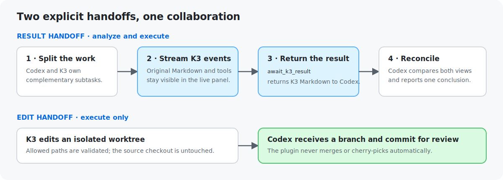
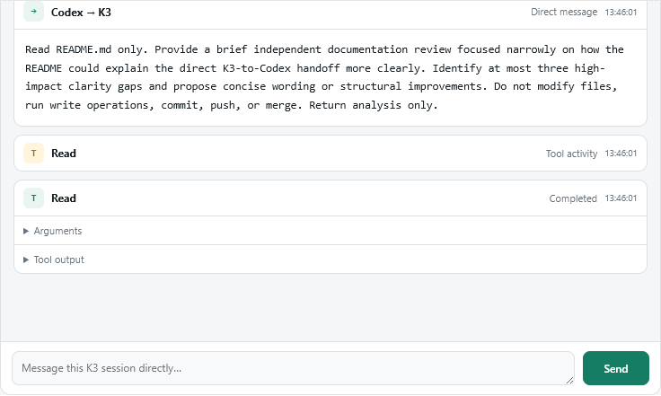
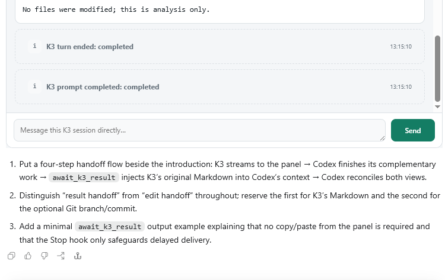
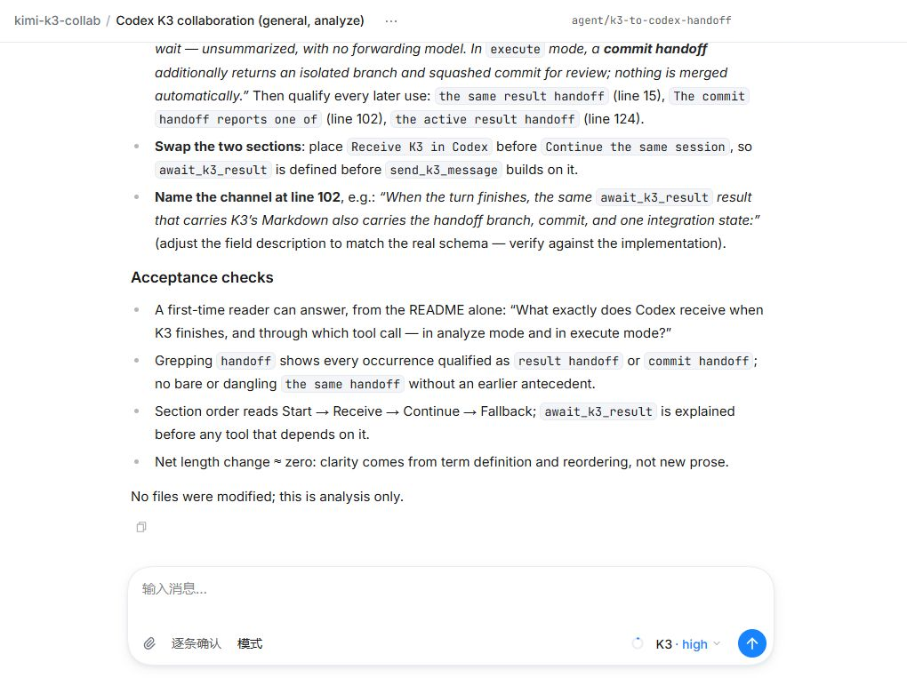

# Kimi K3 Collab

Kimi K3 Collab lets Codex and persistent `kimi-code/k3` work on complementary tasks at the same time. It streams K3's authentic Markdown, tool calls, tasks, and subagents into an MCP App, then hands K3's completed report directly back to Codex for discussion and synthesis.

The plugin targets Windows, macOS, and Linux, and its CI runs the portable and fake-Kimi integration checks on all three platforms. It uses only the Node.js standard library and does not add a forwarding model, a React build, or a status polling loop.



## How it works

1. Codex splits the work and calls `start_k3_collaboration` with K3's independent subtask. The verified K3 session returns immediately.
2. The plugin's MCP server keeps one authenticated loopback WebSocket open for that Kimi session.
3. Codex renders `ui://kimi-k3/live-session-v3.html` as an MCP App component.
4. The component receives raw Kimi frames through the official MCP Apps host bridge and renders Markdown, tools, tasks, subagents, and state changes inside Codex.
5. Codex continues its own different subtask, then calls `await_k3_result`. One event-driven wait completes the **result handoff** by returning K3's original Markdown into Codex's model context.
6. The user or Codex can respond to K3 with `send_k3_message`; the next K3 result returns through the same result handoff.
7. A plugin-bundled Stop hook prevents Codex from silently ending while a started K3 session still has an undelivered result.

For the separate **edit handoff** in `execute` mode, the bridge creates a per-session temporary branch and worktree. K3 never writes the source checkout. When the turn finishes, the bridge rejects out-of-scope changes, squashes committable allowed changes into one local commit, checks for overlapping source changes, and returns the branch/commit to Codex for review. Worktrees containing scope violations, symbolic links/junctions, ignored outputs, or integration failures are preserved instead of silently discarded. The plugin never merges or cherry-picks automatically.

The Kimi server remains the source of truth. Session snapshots are stored under `$KIMI_CODE_HOME/codex-jobs` and active isolated checkouts under `$KIMI_CODE_HOME/codex-worktrees` (default root: `~/.kimi-code`).

## What users see

- K3's original messages and Markdown
- Real file, search, tool, task, and subagent activity supported by Kimi Code
- Direct input to the same K3 session
- K3's completed report delivered directly into Codex for reconciliation
- An isolated Git branch/commit handoff for authorized K3 edits
- Full-screen and browser fallbacks

### Embedded panel in Codex



_The embedded panel keeps K3's original prompt, tool events, completion state, and direct-reply composer visible at full content width._

### Result handoff back to Codex



_An analysis-only README review: K3 completes in the live panel, then Codex reconciles the result delivered by `await_k3_result`. No panel copy/paste is required._

### Kimi Code Web fallback



_The authenticated Web view opens the same K3 session with its original Markdown, workspace context, and direct-reply composer._

This is an MCP App panel plus a model-visible result handoff, not a native Codex subagent identity. Codex and K3 can own different work while the user sees Kimi's original event stream directly.

## No polling

Normal collaboration has no model-driven status loop or token-consuming retries:

- Starting a session returns immediately.
- Kimi pushes events into one persistent server-side WebSocket.
- The private app-only `receive_k3_events` call waits until an event arrives, then returns a batch through the host bridge. The component renews this long-held receive without a Codex model turn.
- `await_k3_result` performs one bounded, event-driven wait after Codex finishes its own subtask. It does not issue periodic status requests.
- The Stop hook uses the same event wait only as a safety net when Codex tries to finish before collecting K3's report.
- A relay with no panel receives for three minutes closes its socket and releases its bounded event buffer.
- `get_k3_status` and `get_k3_result` are explicit fallback tools only.
- Network reconnects may occur after a broken event connection. Reconnect is recovery, not scheduled polling.

## Security

- The bridge accepts only `127.0.0.1`, `localhost`, or `::1` Kimi server locks.
- The component never receives the Kimi bearer token or an authenticated browser URL.
- **Open Kimi Code** uses a loopback gateway with a 60-second single-use ticket and a 10-minute HttpOnly browser session. The gateway adds the persistent Kimi bearer token only on its upstream loopback connection.
- Neither the persistent bearer token nor the one-time ticket is returned in model-visible text, `structuredContent`, or component metadata.
- The MCP App makes no loopback HTTP, WebSocket, or iframe connection. Its CSP has no loopback connect allowlist.
- `receive_k3_events` is private, app-only, and unavailable to the model.
- The panel does not embed Kimi Code as an iframe. **Open Kimi Code** remains an authenticated browser fallback.
- Kimi Code 0.26 may still advertise write-capable tools in `analyze` mode. The plugin uses manual permission mode, a local-only read-tool allowlist, approval rejection, and the same non-read-only tool check in both the live relay and result stream. This is a safety guard, not an operating-system sandbox.
- `WebSearch` and `FetchURL` are not enabled in `analyze` mode. Repository content is still sent to the configured Kimi model when K3 reads it; the loopback Kimi service is a local coordinator and does not imply local model inference.
- Git execute mode canonicalizes the source/Git roots, rejects symbolic links or junctions inside `allowed_paths`, validates final changed paths, and preserves a violating worktree for inspection.
- A session is refused when common credential, private-key, or `.env` paths are accessible unless `sensitive_paths_ack: true` is supplied after explicit user confirmation. Runtime tool paths are checked again. The decision and policy events are written as metadata-only JSONL under `$KIMI_CODE_HOME/codex-jobs/audit`.
- Structured file writes are checked against `allowed_paths`. Shell commands are warned and audited when the active Kimi service was not launched through the configured OS sandbox wrapper.
- Ignored outputs are reported as `unintegrated_ignored_files` and preserved. They are not force-added because ignored files may contain secrets or disposable build state.
- The worktree is not an operating-system sandbox. Absolute-path writes, writes outside the repository, and create-use-delete link races cannot be prevented by this plugin alone; Codex must review the result and use an OS sandbox/container when prevention is required.
- Run `execute` in a dedicated development environment with no production access — a separate OS account, VM, or container. The launched Kimi service inherits its parent process environment, so keep production environment variables, cloud credentials, and unrelated file mounts out of that environment. Plugin path checks and worktree isolation limit what a session writes; they do not hide credentials or files the environment already exposes.
- Non-Git `execute` is disabled by default. `allow_non_git_execute: true` is accepted only after explicit user confirmation; it changes the directory directly under a persistent advisory single-writer lock.

## Requirements

- Node.js 18.18 or newer on Windows, macOS, or Linux
- Kimi Code CLI with local-server and Web UI support, installed and authenticated. The latest stable `0.29.0` is preferred and `0.26.0` remains a tested legacy baseline; other versions are capability-checked but marked untested. See [compatibility](docs/compatibility.md).
- A Codex or ChatGPT host with personal plugins, MCP, and MCP Apps UI support
- Codex lifecycle-hook support for the automatic stop-time handoff safety net
- Git on `PATH` for the default isolated `execute` mode

The bridge finds Kimi on `PATH` or under `$KIMI_CODE_HOME/bin` (default: `~/.kimi-code/bin`). Set `KIMI_CODE_BIN` only when the executable lives elsewhere.

### OS sandbox/container wrapper

Set `KIMI_K3_SERVER_WRAPPER` to an absolute executable path before the plugin starts Kimi Code. The wrapper receives the resolved Kimi executable as its first argument followed by the normal `web --no-open ...` or legacy `server run ...` arguments. It must preserve loopback server discovery under the configured `$KIMI_CODE_HOME`.

Use a dedicated `KIMI_CODE_HOME` for the wrapped service, and stop any already-running Kimi Code service before enabling or changing the wrapper. If the wrapper is configured while an unmarked service is active, the bridge refuses to reuse it. The bridge records the launched service PID/port and reports it as sandboxed only while that exact service remains active. A container wrapper should mount only the intended project paths and Kimi state, bind the Kimi port to loopback, deny unnecessary network/filesystem access, then exec the passed Kimi command. The wrapper is required for enforcing shell write boundaries; plugin path checks alone provide detection and best-effort cancellation.

## Start a collaboration

```text
start_k3_collaboration {
  prompt: "Review this architecture and challenge the failure modes.",
  mode: "analyze",
  focus: "engineering",
  cwd: "/path/to/project"
}
```

For an explicitly approved non-Git directory, add `allow_non_git_execute: true`. For a task that must read a default-sensitive path, add `sensitive_paths_ack: true`. Never set either flag without the user's confirmation.

These flags are auditable friction controls, not an identity or authorization system. The host/user approval boundary remains responsible for ensuring that the confirmation came from the user rather than delegated prompt text.

For authorized edits:

```text
start_k3_collaboration {
  prompt: "Implement the approved change and verify it.",
  mode: "execute",
  focus: "general",
  cwd: "/path/to/project",
  allowed_paths: ["src", "tests"]
}
```

## Continue the same session

Each Codex task uses one persistent K3 session. Continue its work with `send_k3_message` instead of starting a second K3 session.

```text
send_k3_message {
  session_id: "SESSION",
  prompt: "Codex disagrees with the retry policy. Compare both options."
}
```

In a Git project, `allowed_paths` are translated into K3's isolated worktree. Existing uncommitted source changes may coexist only when they do not overlap those paths. The completion handoff reports one of:

- `ready`: source `HEAD` did not move and no source changes overlap K3's files.
- `review_required`: source `HEAD` moved; inspect the returned commit against the new base.
- `conflict_likely`: source working-tree changes overlap K3's changed files.
- `unintegrated_ignored_files`: ignored outputs exist; the worktree is preserved and no commit is created.
- `scope_violation` or `integration_error`: nothing is merged and the isolated worktree is preserved for manual inspection.

Review the returned commit with Git, then cherry-pick it only when appropriate. The plugin intentionally performs no automatic integration. Follow-up K3 turns recreate the same isolated worktree from the handoff branch and produce another scoped commit.

The handoff includes the preserved worktree path when manual review is required. To inspect leftover plugin-managed resources without deleting anything:

```sh
node scripts/kimi-k3.mjs prune
```

After reviewing the list, target one completed handoff explicitly with `prune --delete --session-id <session-id>`. Active sessions and `scope_violation`, `integration_error`, or `unintegrated_ignored_files` worktrees are always preserved. Missing-record and non-empty unregistered resources are reported but never deleted automatically; a known terminal worktree directory is removed only when it is already empty.

## Receive K3 in Codex

After Codex finishes its own complementary subtask, it waits for K3 once:

```text
await_k3_result {
  session_id: "SESSION",
  wait_seconds: 100
}
```

The tool returns K3's original Markdown directly to Codex. If K3 needs longer and no useful Codex work remains, the trusted Stop hook takes over the longer event wait. Without that hook, Codex may make one later bounded await; if K3 is still running, it should ask whether to keep waiting or cancel. During automatic waiting it must not narrate repeated waiting, run Git/status filler checks, or use status/result tools for polling.

The installed plugin also contributes a Stop hook. Review and trust that hook when Codex prompts you; in the CLI it appears under `/hooks`. Without hook trust, direct `await_k3_result` still works, but the automatic “do not finish before K3 reports” safety net is disabled. The hook can recover the active K3 handoff from the current Codex transcript when a host path skips `PostToolUse`, then wait event-first for up to nine minutes within Codex's documented 600-second hook timeout.

Reopen the direct panel:

```text
open_k3_panel { session_id: "SESSION" }
```

Omit `session_id` to open the latest recorded session.

## Explicit fallback tools

Use these only when the user asks Codex to inspect or stop the K3 session:

```text
get_k3_status { session_id: "SESSION" }
get_k3_result { session_id: "SESSION" }
cancel_k3_job { session_id: "SESSION" }
```

## Host fallback

MCP Apps-compatible hosts with app-initiated tool calls render the pushed event panel inline. The component does not need loopback network access. If a host lacks the MCP Apps tool bridge, use **Open Kimi Code**; the fallback opens the same authenticated session.

CLI clients without MCP Apps UI still expose the control tools and readable fallback results, but they cannot render the live panel.

## Local installation

```sh
git clone https://github.com/entropyMin/kimi-k3-collab.git kimi-k3-collab
cd kimi-k3-collab
git checkout <tag-or-commit>
npm run check
npm test
```

Pin the installation to a specific Git tag or commit rather than a moving branch. To upgrade, check out the new ref in a separate test clone first and run `npm run check` and `npm test` there — plus `npm run test:real-kimi` when the update touches live Kimi interaction. Only after those pass, update the pinned ref in the registered directory of your regular development environment; starting a new Codex task then loads the updated plugin.

`npm test` uses a fake Kimi REST/WebSocket server and requires no Kimi login. It exercises the real MCP server and bridge through analyze and isolated execute handoffs. CI runs the portable and fake-Kimi suites on Windows, macOS, and Ubuntu across the minimum Node.js 18.18 runtime and supported Node.js LTS releases. Run `npm run test:real-kimi` for the optional real session/prompt/WebSocket/result handoff against the installed, authenticated Kimi Code service; it consumes one model request.

Register that directory as `kimi-k3-collab` in the personal Codex marketplace, install `kimi-k3-collab@personal`, and start a new Codex task so the updated skill, tools, and MCP resource are loaded.
